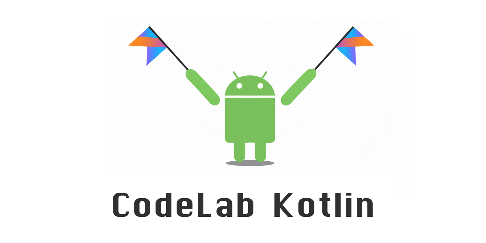

# CodeLab Kotlin - Infosoft 2017

## Resumen

Este codelab está enfocado al desarrollo de aplicaciones Android usando Kotlin. Iniciaremos con una introducción a este lenguaje , sus características, ventajas, interoperabilidad y diferencias con java. Luego, usaremos Android Studio para implementar  un ejemplo práctico de una aplicación Android desarrollada con Kotlin.

##  Bienvenido

##   Instala Android Studio

- Trabajaremos con la versión 2.3.3 de Android Studio que pueden descargar desde el este link https://developer.android.com/studio/index.html . Esta versión requiere un plugin para poder usar Kotlin.

- La versión 3.0+ de Android Studio ya soporta Kotlin pero aún esta en versión beta. Pueden encontrar más información en el siguiente link https://developer.android.com/studio/preview/index.html

##  Crea tu primer proyecto y configura el plugin de Kotlin

## 4 Infosoft App

## 5 Construye las Vistas y la UI de tu App

## 6 Agrega interactividad  a tu app mediante eventos

## 7 Maneja Listas y Adaptaders usando RecyclerView

## 8 Carga datos dinámicamente y aprende sobre persistencia de datos.

## 9 Referencias 

- Google CodeLabs Kotlin https://codelabs.developers.google.com/codelabs/build-your-first-android-app-kotlin/
- Android Studio 

